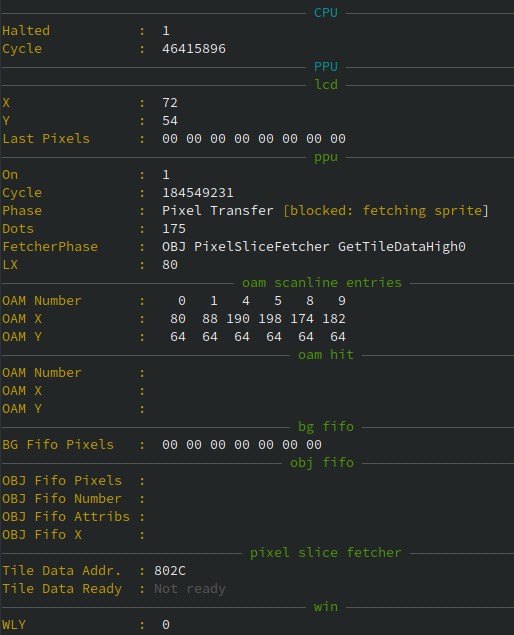
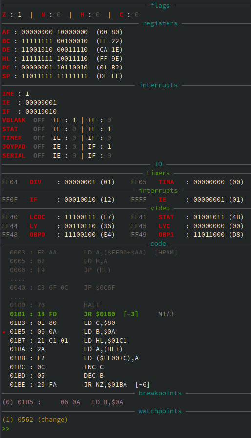
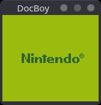

# DocBoy

GameBoy emulator written in C++17.

Can be used either with the standalone SDL frontend or as a libretro core (e.g. with RetroArch).

This is not the first nor the last of the GB emulator, but the aim of DocBoy is to find a good balance between:
1. Emulation accuracy
2. Speed and efficiency
3. Easy enough to understand

**Bonus**: a good CLI debugger (in the style of GDB).

### Features

* CPU: m-cycle accurate
* PPU: t-cycle accurate (implements Pixel FIFO)
* Cartridges: NoMBC, MBC1, MBC3, MBC5
* CLI debugger: supports breakpoints, watchpoints, disassembler, step by step execution (by instruction, m-cycle or by t-cycle), rewind, memory viewer, interrupts viewer, IO viewer
* Serial Link (with the possibility to print the serial output to console)
* Bootroom support
* Joypad
* DMA
* Save / Load (RAM)
* Save state / Load state

### TODO
* Cartridges: MBC2
* Sound
* GBC (add colors support)
* Tests: add more test roms
* Platforms: Windows, macOs
* Benchmarks and optimization

## Build

DocBoy is compiled as a static library which can be used by a _frontend_.

These are the cmake options for the available frontends.

* `BUILD_NOGUI_FRONTEND`
* `BUILD_SDL_FRONTEND`
* `BUILD_LIBRETRO_CORE`
* `BUILD_LIBRETRO_CORE_ANDROID`

You have to enable at least one of them.

For example, to build libretro core in Release mode.

```
mkdir build
cd build
cmake .. -DBUILD_LIBRETRO_CORE=ON
make -j 8
```


**Android**

To build the libretro core for Android you have to
1. Install [NDK](https://developer.android.com/ndk/guides).
2. Enable the cmake's option `BUILD_LIBRETRO_CORE_ANDROID`.
3. Set the cmake's option `NDK_PATH` to your NDK path (the folder should contain the `ndk-path` executable).

That is:
```
mkdir build
cd build
cmake .. -DBUILD_LIBRETRO_CORE_ANDROID=ON -DNDK_PATH=/opt/AndroidSdk/ndk/25.2.9519653/build
make
```

_Note_: use just `make` instead of `make -j`; it does not work with NDK build.

## Usage

#### SDL frontend

```build/docboy-sdl <rom>```

```
usage: [--boot-rom BOOT-ROM] [--serial] [--scaling SCALING] [--cartridge-info]
       [--debugger] [--help] rom

positional arguments:
  rom                       ROM

optional arguments:
  -s, --serial              Display serial console
  -z, --scaling SCALING     Scaling factor
  -i, --cartridge-info      Dump cartridge info and quit
  -d, --debugger            Attach debugger
  -h, --help                Display this help message and exit.
```

**Controls**

| Button | Action                   |
|--------|--------------------------|
| F1     | Save State               |
| F2     | Load State               |
| F11    | Dump framebuffer         |
| F12    | Screenshot               |
| f      | Show / Hide FPS          |
| q      | Decrease speed           |
| w      | Increase speed           |
| d      | Attach / Detach debugger |
| Enter  | GameBoy START            |
| Tab    | GameBoy SELECT           |
| z      | GameBoy A                |
| x      | GameBoy B                |
| Up     | GameBoy UP               |
| Right  | GameBoy RIGHT            |
| Down   | GameBoy DOWN             |
| Left   | GameBoy LEFT             |

#### libretro frontend

Using retroarch, you can use the libretro core as follows.

```retroarch -L build/docboy_libretro.so <rom>```

## Debugging

DocBoy offers a debugger that's really useful to see what's going on.

To build with the debugger enable the cmake's `ENABLE_DEBUGGER` option.

```
mkdir build
cd build
cmake .. -DBUILD_SDL_FRONTEND=ON -DENABLE_DEBUGGER=ON
make -j 8
```

Use the `-d` option to run with the debugger already attached.

**Commands**

With `help` you can list the commands:
```
b <addr>                          : Set breakpoint at <addr>
w[/r|a] <start>,<end> [<cond>]    : Set watchpoint from <start> to <end>
w[/r|a] <addr> [<cond>]           : Set watchpoint at <addr>
del <num>                         : Delete breakpoint or watchpoint <num>
ad <num>                          : Automatically disassemble next <n> instructions (default = 10)
d [<n>]                           : Disassemble next <n> instructions (default = 10)
d <start>,<end>                   : Disassemble instructions from address <start> to <end>
x[/<length><format>] <addr>       : Display memory content at <addr> (<format>: x, h[<cols>], b, d, i)
/b <bytes>                        : Search for <bytes>
/i <bytes>                        : Search for instructions matching <bytes>
display[/<length><format>] <addr> : Automatically display memory content content at <addr> (<format>: x, h[<cols>], b, d, i)
undisplay                         : Undisplay expressions set with display
show <section>                    : Show a section in the debugger layout
hide <section>                    : Hide a section from the debugger layout
. [<count>]                       : Continue running for <count> PPU dots (default = 1)
s [<count>]                       : Continue running for <count> instructions (default = 1)
si [<count>]                      : Continue running for <count> micro-operations (default = 1)
n [<count>]                       : Continue running for <count> instructions at the same stack level (default = 1)
ni [<count>]                      : Continue running for <count> micro-operations at the same stack level (default = 1)
f [<count>]                       : Continue running for <count> frames (default = 1)
fb [<count>]                      : Step back by <count> frames (default = 1, max = 600)
l [<count>]                       : Continue running for <count> lines (default = 1)
c                                 : Continue
trace [<level>]                   : Set the trace level or toggle it (output on stderr)
dump                              : Dump the disassemble (output on stderr)
h                                 : Display help
q                                 : Quit
```

Here's the debugger!




## Screenshots




## Tests results

**CPU**

| Collection | Test       | Status             |
|------------|------------|--------------------|
| blargg     | cpu_instrs | :white_check_mark: |
| blargg     | instr_timing | :white_check_mark: |
| mooneye    | instr    | :white_check_mark:        |


**PPU**

| Collection | Test      | Status             |
|------------|-----------|--------------------|
| dmg-agic2  | dmg-acid2 | :white_check_mark: |

**Timers**

| Collection | Test     | Status             |
|------------|----------|--------------------|
| mooneye    | timers   | :white_check_mark: |

**MBC**

| Collection | Test     | Status              |
|------------|----------|---------------------|
| mooneye    | mbc/mbc1 | :white_check_mark:  |
| mooneye    | mbc/mbc5 | :white_check_mark:  |

**IO**

| Collection | Test     | Status             |
|------------|----------|--------------------|
| mooneye    | bits     | :white_check_mark: |

