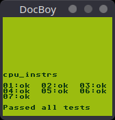

# DocBoy

GameBoy emulator written in C++20.

Work in Progress.

### Features

* CPU: m-cycle accurate, passes cpu_instrs.gb from blargg's tests
* PPU: dot accurate, implements pixel FIFO
* Cartridges: NoMBC, MBC1, MBC3
* CLI debugger: supports breakpoints, watchpoints, disassembler, step by step execution (by instruction or micro-instruction), rewind, memory viewer, interrupts viewer, IO viewer
* Serial Link
* Bootroom support
* Joypad
* DMA
* Save / Load
* Save state / Load state

### TODO
* Improve accuracy of PPU
* Support other cartridges types
* Implement sound
* Support other platforms: Windows, macOs
* Compile as libretro core

### Building

#### Linux

```
mkdir build
cd build
cmake ..
make
```


### Usage

```
usage: [--boot-rom BOOT-ROM] [--config CONFIG] [--serial] [--scaling SCALING]
       [--speed-up SPEED-UP] [--cartridge-info] [--help] rom

positional arguments:
  rom                     ROM

optional arguments:
  -b, --boot-rom BOOT-ROM Boot ROM
  -c, --config CONFIG     Config
  -s, --serial            Display serial output
  -z, --scaling SCALING   Scaling factor
  -x, --speed-up SPEED-UP Speed up factor
  -i, --cartridge-info    Dump cartridge info and quit
  -h, --help              Display this help message and exit.
```


### Screenshots




### Tests

State of [blargg's test roms](https://github.com/retrio/gb-test-roms).

| Rom          | Passed | Status             |
|--------------|--------|--------------------|
| dmg_sound    |        |                    |
| cpu_instrs   | 11/11  | :white_check_mark: |
| instr_timing |        |                    |
| mem_timing   |        |                    |
| mem_timing-2 |        |                    |
| oam_bug      |        |                    |


