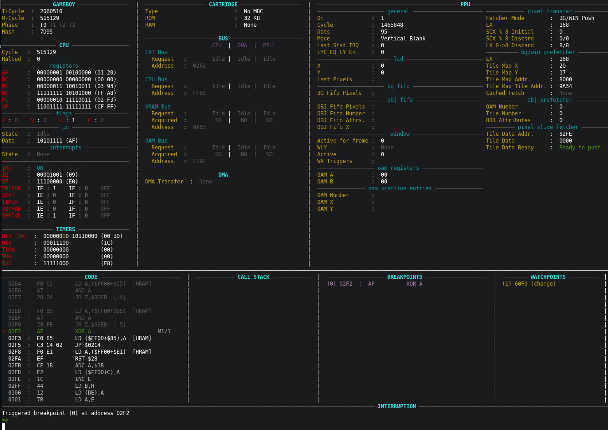
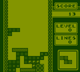
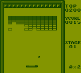
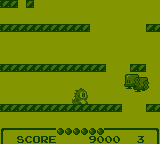
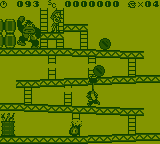
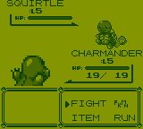
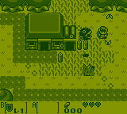
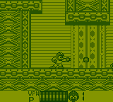

# DocBoy

GameBoy (DMG) emulator written in C++17.

Can be used either with the standalone SDL frontend or as a libretro core (e.g. with RetroArch).

DocBoy is a accuracy-focused GB emulator that tries to find a good spot between:
1. Emulation accuracy
2. Speed and efficiency
3. Code clarity

**Bonus**: a good CLI debugger (in the style of GDB).

### Features

* CPU: M-cycle accurate
* PPU: T-cycle accurate (implements Pixel FIFO)
* Cartridges: NoMBC, MBC1, MBC2, MBC3, MBC5
* CLI debugger: supports breakpoints, watchpoints, disassembler, step by step execution (by instruction, m-cycle or by t-cycle), rewind, memory viewer, interrupts viewer, IO viewer
* Serial Link (with the possibility to print the serial output to console)
* Bootroom support
* Joypad
* DMA
* Multiple buses (EXT, CPU, OAM, VRAM) and MMU (for precise read/write conflicts handling)
* Save / Load (RAM)
* Save state / Load state

### TODO
* Sound
* GBC (add colors support)
* RTC

## Build

DocBoy is compiled as a static library which can be used by a _frontend_.

These are the cmake options for the available frontends.

* `BUILD_NOGUI_FRONTEND`
* `BUILD_SDL_FRONTEND`
* `BUILD_LIBRETRO_CORE`
* `BUILD_LIBRETRO_CORE_ANDROID`

You have to enable at least one of them.

For example, to build libretro core in Release mode.

```
mkdir build
cd build
cmake .. -DBUILD_LIBRETRO_CORE=ON
make -j 8
```


**Android**

To build the libretro core for Android you have to
1. Install [NDK](https://developer.android.com/ndk/guides).
2. Enable the cmake's option `BUILD_LIBRETRO_CORE_ANDROID`.
3. Set the cmake's option `NDK_PATH` to your NDK path (the folder should contain the `ndk-path` executable).

That is:
```
mkdir build
cd build
cmake .. -DBUILD_LIBRETRO_CORE_ANDROID=ON -DNDK_PATH=/opt/AndroidSdk/ndk/25.2.9519653/build
make
```

_Note_: use just `make` instead of `make -j`; it does not work with NDK build.

## Usage

#### SDL frontend

```build/docboy-sdl <rom>```

```
usage: [--boot-rom BOOT-ROM] [--serial] [--scaling SCALING] [--cartridge-info]
       [--debugger] [--help] rom

positional arguments:
  rom                       ROM

optional arguments:
  -s, --serial              Display serial console
  -z, --scaling SCALING     Scaling factor
  -i, --cartridge-info      Dump cartridge info and quit
  -d, --debugger            Attach debugger
  -h, --help                Display this help message and exit.
```

**Controls**

| Button | Action                   |
|--------|--------------------------|
| F1     | Save State               |
| F2     | Load State               |
| F11    | Dump framebuffer         |
| F12    | Screenshot               |
| f      | Show / Hide FPS          |
| q      | Decrease speed           |
| w      | Increase speed           |
| d      | Attach / Detach debugger |
| Enter  | GameBoy START            |
| Tab    | GameBoy SELECT           |
| z      | GameBoy A                |
| x      | GameBoy B                |
| Up     | GameBoy UP               |
| Right  | GameBoy RIGHT            |
| Down   | GameBoy DOWN             |
| Left   | GameBoy LEFT             |

#### libretro frontend

Using retroarch, you can use the libretro core as follows.

```retroarch -L build/docboy_libretro.so <rom>```

## Debugging

DocBoy offers a debugger that's really useful to see what's going on.

To build with the debugger enable the cmake's `ENABLE_DEBUGGER` option.

```
mkdir build
cd build
cmake .. -DBUILD_SDL_FRONTEND=ON -DENABLE_DEBUGGER=ON
make -j 8
```

Use the `-d` option to run with the debugger already attached.

**Commands**

With `help` you can list the commands:
```
b <addr>                          : Set breakpoint at <addr>
w[/r|a] <start>,<end> [<cond>]    : Set watchpoint from <start> to <end>
w[/r|a] <addr> [<cond>]           : Set watchpoint at <addr>
del <num>                         : Delete breakpoint or watchpoint <num>
ad <num>                          : Automatically disassemble next <n> instructions (default = 10)
d [<n>]                           : Disassemble next <n> instructions (default = 10)
d <start>,<end>                   : Disassemble instructions from address <start> to <end>
x[/<length><format>] <addr>       : Display memory content at <addr> (<format>: x, h[<cols>], b, d, i)
/b <bytes>                        : Search for <bytes>
/i <bytes>                        : Search for instructions matching <bytes>
display[/<length><format>] <addr> : Automatically display memory content content at <addr> (<format>: x, h[<cols>], b, d, i)
undisplay                         : Undisplay expressions set with display
t [<count>]                       : Continue running for <count> clock ticks (default = 1)
. [<count>]                       : Continue running for <count> PPU dots (default = 1)
s [<count>]                       : Continue running for <count> instructions (default = 1)
si [<count>]                      : Continue running for <count> micro-operations (default = 1)
n [<count>]                       : Continue running for <count> instructions at the same stack level (default = 1)
ni [<count>]                      : Continue running for <count> micro-operations at the same stack level (default = 1)
f [<count>]                       : Continue running for <count> frames (default = 1)
fb [<count>]                      : Step back by <count> frames (default = 1, max = 600)
l [<count>]                       : Continue running for <count> lines (default = 1)
c                                 : Continue
trace [<level>]                   : Set the trace level or toggle it (output on stderr)
dump                              : Dump the disassemble (output on stderr)
h                                 : Display help
q                                 : Quit
```

Here's the debugger!



## Screenshots













## Tests results


#### blargg

| Test Rom                            |       Result       |
|-------------------------------------|:------------------:|
| blargg/cpu_instrs.gb                | :white_check_mark: |
| blargg/cpu_instrs.gb                | :white_check_mark: |
| blargg/cpu_instrs.gb                | :white_check_mark: |
| blargg/cpu_instrs.gb                | :white_check_mark: |
| blargg/cpu_instrs.gb                | :white_check_mark: |
| blargg/halt_bug.gb                  | :white_check_mark: |
| blargg/instr_timing.gb              | :white_check_mark: |
| blargg/mem_timing-2.gb              | :white_check_mark: |
| blargg/mem_timing.gb                | :white_check_mark: |
| blargg/oam_bug/1-lcd_sync.gb        | :white_check_mark: |
| blargg/oam_bug/2-causes.gb          | :white_check_mark: |
| blargg/oam_bug/3-non_causes.gb      | :white_check_mark: |
| blargg/oam_bug/4-scanline_timing.gb | :white_check_mark: |
| blargg/oam_bug/5-timing_bug.gb      | :white_check_mark: |
| blargg/oam_bug/6-timing_no_bug.gb   | :white_check_mark: |
| blargg/oam_bug/8-instr_effect.gb    | :white_check_mark: |


#### dmg-acid2

| Test Rom                                      |       Result       |
|-----------------------------------------------|:------------------:|
| dmg-acid2/dmg-acid2.gb                        | :white_check_mark: |


#### hacktix

| Test Rom                 |       Result        |
|--------------------------|:-------------------:|
| hacktix/bully.gb         | :white_check_mark:  |
| hacktix/strikethrough.gb | :white_check_mark:  |


#### samesuite

| Test Rom                   |       Result        |
|----------------------------|:-------------------:|
| samesuite/ei_delay_halt.gb | :white_check_mark:  |


#### daid

| Test Rom                   |       Result        |
|----------------------------|:-------------------:|
| daid/stop_instr.gb         | :white_check_mark:  |
| daid/ppu_scanline_bgp.gb   | :white_check_mark:  |


#### little-things-gb

| Test Rom                               |       Result        |
|----------------------------------------|:-------------------:|
| little-things-gb/double-halt-cancel.gb | :white_check_mark:  |


#### mooneye

| Test Rom                                    |       Result       |
|---------------------------------------------|:------------------:|
| mooneye/add_sp_e_timing.gb                  | :white_check_mark: |
| mooneye/bits/mem_oam.gb                     | :white_check_mark: |
| mooneye/bits/reg_f.gb                       | :white_check_mark: |
| mooneye/bits/unused_hwio-GS.gb              | :white_check_mark: |
| mooneye/boot_div-dmgABCmgb.gb               | :white_check_mark: |
| mooneye/boot_hwio-dmgABCmgb.gb              | :white_check_mark: |
| mooneye/boot_regs-dmgABC.gb                 | :white_check_mark: |
| mooneye/call_cc_timing2.gb                  | :white_check_mark: |
| mooneye/call_cc_timing.gb                   | :white_check_mark: |
| mooneye/call_timing2.gb                     | :white_check_mark: |
| mooneye/call_timing.gb                      | :white_check_mark: |
| mooneye/di_timing-GS.gb                     | :white_check_mark: |
| mooneye/div_timing.gb                       | :white_check_mark: |
| mooneye/ei_sequence.gb                      | :white_check_mark: |
| mooneye/ei_timing.gb                        | :white_check_mark: |
| mooneye/halt_ime0_ei.gb                     | :white_check_mark: |
| mooneye/halt_ime0_nointr_timing.gb          | :white_check_mark: |
| mooneye/halt_ime1_timing2-GS.gb             | :white_check_mark: |
| mooneye/halt_ime1_timing.gb                 | :white_check_mark: |
| mooneye/if_ie_registers.gb                  | :white_check_mark: |
| mooneye/instr/daa.gb                        | :white_check_mark: |
| mooneye/interrupts/ie_push.gb               | :white_check_mark: |
| mooneye/intr_timing.gb                      | :white_check_mark: |
| mooneye/jp_cc_timing.gb                     | :white_check_mark: |
| mooneye/jp_timing.gb                        | :white_check_mark: |
| mooneye/ld_hl_sp_e_timing.gb                | :white_check_mark: |
| mooneye/mbc/mbc1/bits_bank1.gb              | :white_check_mark: |
| mooneye/mbc/mbc1/bits_bank2.gb              | :white_check_mark: |
| mooneye/mbc/mbc1/bits_mode.gb               | :white_check_mark: |
| mooneye/mbc/mbc1/bits_ramg.gb               | :white_check_mark: |
| mooneye/mbc/mbc1/ram_256kb.gb               | :white_check_mark: |
| mooneye/mbc/mbc1/ram_64kb.gb                | :white_check_mark: |
| mooneye/mbc/mbc1/rom_16Mb.gb                | :white_check_mark: |
| mooneye/mbc/mbc1/rom_1Mb.gb                 | :white_check_mark: |
| mooneye/mbc/mbc1/rom_2Mb.gb                 | :white_check_mark: |
| mooneye/mbc/mbc1/rom_4Mb.gb                 | :white_check_mark: |
| mooneye/mbc/mbc1/rom_512kb.gb               | :white_check_mark: |
| mooneye/mbc/mbc1/rom_8Mb.gb                 | :white_check_mark: |
| mooneye/mbc/mbc2/bits_ramg.gb               | :white_check_mark: |
| mooneye/mbc/mbc2/bits_romb.gb               | :white_check_mark: |
| mooneye/mbc/mbc2/bits_unused.gb             | :white_check_mark: |
| mooneye/mbc/mbc2/ram.gb                     | :white_check_mark: |
| mooneye/mbc/mbc2/rom_1Mb.gb                 | :white_check_mark: |
| mooneye/mbc/mbc2/rom_2Mb.gb                 | :white_check_mark: |
| mooneye/mbc/mbc2/rom_512kb.gb               | :white_check_mark: |
| mooneye/mbc/mbc5/rom_16Mb.gb                | :white_check_mark: |
| mooneye/mbc/mbc5/rom_1Mb.gb                 | :white_check_mark: |
| mooneye/mbc/mbc5/rom_2Mb.gb                 | :white_check_mark: |
| mooneye/mbc/mbc5/rom_32Mb.gb                | :white_check_mark: |
| mooneye/mbc/mbc5/rom_4Mb.gb                 | :white_check_mark: |
| mooneye/mbc/mbc5/rom_512kb.gb               | :white_check_mark: |
| mooneye/mbc/mbc5/rom_64Mb.gb                | :white_check_mark: |
| mooneye/mbc/mbc5/rom_8Mb.gb                 | :white_check_mark: |
| mooneye/oam_dma/basic.gb                    | :white_check_mark: |
| mooneye/oam_dma/reg_read.gb                 | :white_check_mark: |
| mooneye/oam_dma_restart.gb                  | :white_check_mark: |
| mooneye/oam_dma/sources-GS.gb               | :white_check_mark: |
| mooneye/oam_dma_start.gb                    | :white_check_mark: |
| mooneye/oam_dma_timing.gb                   | :white_check_mark: |
| mooneye/pop_timing.gb                       | :white_check_mark: |
| mooneye/ppu/hblank_ly_scx_timing-GS.gb      | :white_check_mark: |
| mooneye/ppu/intr_1_2_timing-GS.gb           | :white_check_mark: |
| mooneye/ppu/intr_2_0_timing.gb              | :white_check_mark: |
| mooneye/ppu/intr_2_mode0_timing.gb          | :white_check_mark: |
| mooneye/ppu/intr_2_mode0_timing_sprites.gb  | :white_check_mark: |
| mooneye/ppu/intr_2_mode3_timing.gb          | :white_check_mark: |
| mooneye/ppu/intr_2_oam_ok_timing.gb         | :white_check_mark: |
| mooneye/ppu/lcdon_timing-GS.gb              | :white_check_mark: |
| mooneye/ppu/lcdon_write_timing-GS.gb        | :white_check_mark: |
| mooneye/ppu/stat_irq_blocking.gb            | :white_check_mark: |
| mooneye/ppu/stat_lyc_onoff.gb               | :white_check_mark: |
| mooneye/ppu/vblank_stat_intr-GS.gb          | :white_check_mark: |
| mooneye/push_timing.gb                      | :white_check_mark: |
| mooneye/rapid_di_ei.gb                      | :white_check_mark: |
| mooneye/ret_cc_timing.gb                    | :white_check_mark: |
| mooneye/reti_intr_timing.gb                 | :white_check_mark: |
| mooneye/reti_timing.gb                      | :white_check_mark: |
| mooneye/ret_timing.gb                       | :white_check_mark: |
| mooneye/rst_timing.gb                       | :white_check_mark: |
| mooneye/serial/boot_sclk_align-dmgABCmgb.gb | :white_check_mark: |
| mooneye/timers/div_write.gb                 | :white_check_mark: |
| mooneye/timers/rapid_toggle.gb              | :white_check_mark: |
| mooneye/timers/tim00_div_trigger.gb         | :white_check_mark: |
| mooneye/timers/tim00.gb                     | :white_check_mark: |
| mooneye/timers/tim01_div_trigger.gb         | :white_check_mark: |
| mooneye/timers/tim01.gb                     | :white_check_mark: |
| mooneye/timers/tim10_div_trigger.gb         | :white_check_mark: |
| mooneye/timers/tim10.gb                     | :white_check_mark: |
| mooneye/timers/tim11_div_trigger.gb         | :white_check_mark: |
| mooneye/timers/tim11.gb                     | :white_check_mark: |
| mooneye/timers/tima_reload.gb               | :white_check_mark: |
| mooneye/timers/tima_write_reloading.gb      | :white_check_mark: |
| mooneye/timers/tma_write_reloading.gb       | :white_check_mark: |
| mooneye/timers/tma_write_reloading.gb       | :white_check_mark: |

#### mealybug

| Test Rom                                      |       Result       |
|-----------------------------------------------|:------------------:|
| mealybug/m2_win_en_toggle.gb                  | :white_check_mark: |
| mealybug/m3_bgp_change.gb                     | :white_check_mark: |
| mealybug/m3_bgp_change_sprites.gb             | :white_check_mark: |
| mealybug/m3_lcdc_bg_en_change.gb              | :white_check_mark: |
| mealybug/m3_lcdc_bg_map_change.gb             | :white_check_mark: |
| mealybug/m3_lcdc_obj_en_change.gb             | :white_check_mark: |
| mealybug/m3_lcdc_obj_en_change_variant.gb     | :white_check_mark: |
| mealybug/m3_lcdc_obj_size_change.gb           | :white_check_mark: |
| mealybug/m3_lcdc_obj_size_change_scx.gb       | :white_check_mark: |
| mealybug/m3_lcdc_tile_sel_change.gb           | :white_check_mark: |
| mealybug/m3_lcdc_tile_sel_win_change.gb       | :white_check_mark: |
| mealybug/m3_lcdc_win_en_change_multiple.gb    | :white_check_mark: |
| mealybug/m3_lcdc_win_en_change_multiple_wx.gb | :white_check_mark: |
| mealybug/m3_lcdc_win_map_change.gb            | :white_check_mark: |
| mealybug/m3_obp0_change.gb                    | :white_check_mark: |
| mealybug/m3_scx_high_5_bits.gb                | :white_check_mark: |
| mealybug/m3_scx_low_3_bits.gb                 | :white_check_mark: |
| mealybug/m3_scy_change.gb                     | :white_check_mark: |
| mealybug/m3_window_timing.gb                  | :white_check_mark: |
| mealybug/m3_window_timing_wx_0.gb             | :white_check_mark: |
| mealybug/m3_wx_4_change.gb                    | :white_check_mark: |
| mealybug/m3_wx_4_change_sprites.gb            | :white_check_mark: |
| mealybug/m3_wx_5_change.gb                    | :white_check_mark: |
| mealybug/m3_wx_6_change.gb                    | :white_check_mark: |
