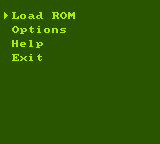

# DocBoy

DocBoy is an open source, accuracy-focused, GameBoy (DMG) emulator, written in C++17.

Can be used either with the standalone SDL frontend or as a libretro core (e.g. with RetroArch).

---

## Features

### GameBoy features
* CPU: M-cycle accurate
* PPU: T-cycle accurate (implements Pixel FIFO)
* APU (sound)
* Colors (CGB)
* Cartridges: NoMBC, MBC1, MBC2, MBC3, MBC5
* Real Time Clock (RTC) emulation
* Memory buses (EXT, CPU, OAM, VRAM) and MMU (for accurately handle read/write conflicts)
* Timers
* Interrupts
* DMA
* JoyPad

### Frontend features
* CLI debugger (in GDB style): supports disassemble, breakpoints, watchpoints, step by step execution, rewind, memory viewer, interrupts viewer, IO viewer
* Serial Link (output to console)
* Save/Load
* Save/Load state
* Fast-forward
* Configurable palette
* Screenshots
* Graphical menu (SDL)


---

## Installation

You can find the latest executables for both Windows and Linux in the [Releases Page](https://github.com/Docheinstein/docboy/releases).

Alternatively, you can build the project by yourself as explained below.

### Clone
Clone the repository and its submodules.

```
git clone https://github.com/Docheinstein/docboy.git --recurse-submodules
```

### Build

DocBoy can be compiled as a static library which can be used by a _frontend_.

These are the CMake options for the available _frontends_.

* `BUILD_SDL_FRONTEND` (default)
* `BUILD_LIBRETRO_CORE`
* `BUILD_LIBRETRO_CORE_ANDROID`
* `BUILD_NOGUI_FRONTEND`

**SDL**

```
mkdir build
cd build
cmake ..
make -j 8
```

Additional dependencies:
* An audio framework: for Linux you can install [alsa-lib](https://github.com/alsa-project/alsa-lib)

**Libretro Core**

```
mkdir build
cd build
cmake .. -DBUILD_LIBRETRO_CORE=ON
make -j 8
```


**Android**

1. Install [NDK](https://developer.android.com/ndk/guides).
2. Enable the CMake option `BUILD_LIBRETRO_CORE_ANDROID`.
3. Set the CMake option `NDK_PATH` to your NDK path (the folder should contain the `ndk-path` executable).

That is:
```
mkdir build
cd build
cmake .. -DBUILD_LIBRETRO_CORE_ANDROID=ON -DNDK_PATH=/opt/AndroidSdk/ndk/25.2.9519653/build
make
```

_Note_: use just `make` instead of `make -j`; the latter does not work with NDK build.

---

## Usage

### SDL

```
usage: [rom] [--config CONFIG] [--serial] [--scaling SCALING] [--cartridge-info]
       [--debugger] [--help]

positional arguments:
  rom                    ROM

options:
  -c, --config CONFIG    Read configuration file
  -s, --serial           Display serial console
  -z, --scaling SCALING  Scaling factor
  -i, --cartridge-info   Dump cartridge info and quit
  -d, --debugger         Attach debugger
  -h, --help             Display this help message and quit
```

**Controls**

These are the default controls.

All the joypad keys can be remapped through the _Control Options_ menu.

| Button | Action                   |
|--------|--------------------------|
| F1     | Save State               |
| F2     | Load State               |
| F11    | Dump framebuffer         |
| F12    | Screenshot               |
| F      | Show / Hide FPS          |
| Q      | Decrease speed           |
| W      | Increase speed           |
| D      | Attach / Detach debugger |
| Enter  | START                    |
| Tab    | SELECT                   |
| Z      | A                        |
| X      | B                        |
| Up     | UP                       |
| Right  | RIGHT                    |
| Down   | DOWN                     |
| Left   | LEFT                     |

### Retroarch (libretro)

With [RetroArch](https://www.retroarch.com/) (supported by almost every existing platform, including Android and iOS), you can _Load Core_ the libretro core compiled with the `BUILD_LIBRETRO_CORE` or `BUILD_LIBRETRO_CORE_ANDROID`.

If you're on a desktop environment, you can also load the core from command line:

```retroarch -L build/docboy_libretro.so <rom>```

---

## Debugging

DocBoy offers a CLI debugger (in GDB style) that's really useful to see what's going on under the hood.

To build with the debugger support, enable the CMake `ENABLE_DEBUGGER` option.

```
mkdir build
cd build
cmake .. -DENABLE_DEBUGGER=ON
make -j 8
```

Use the `-d` option to run with the debugger already attached from the beginning, or press the key `D` to attach/detach the debugger at any time.

**Commands**

With `help` you can list the commands:
```
help
b <addr>                             : Set breakpoint at <addr>
w[/r|a] <start>,<end> [<cond>]       : Set watchpoint from <start> to <end>
w[/r|a] <addr> [<cond>]              : Set watchpoint at <addr>
del <num>                            : Delete breakpoint or watchpoint <num>
ad <num>                             : Automatically disassemble next <n> instructions (default = 10)
x[x][/<length><format>] <addr>       : Display memory at <addr> (x: raw) (<format>: x, h[<cols>], b, d, i)
/b <bytes>                           : Search for <bytes>
/i <bytes>                           : Search for instructions matching <bytes>
display[x][/<length><format>] <addr> : Automatically display memory at <addr> (x: raw) (<format>: x, h[<cols>], b, d, i)
undisplay                            : Undisplay expressions set with display
t [<count>]                          : Continue running for <count> clock ticks (default = 1)
. [<count>]                          : Continue running for <count> PPU dots (default = 1)
s [<count>]                          : Continue running for <count> instructions (default = 1)
si [<count>]                         : Continue running for <count> micro-operations (default = 1)
n [<count>]                          : Continue running for <count> instructions at the same stack level (default = 1)
ni [<count>]                         : Continue running for <count> micro-operations at the same stack level (default = 1)
f [<count>]                          : Continue running for <count> frames (default = 1)
fb [<count>]                         : Step back by <count> frames (default = 1, max = 600)
l [<count>]                          : Continue running for <count> lines (default = 1)
c                                    : Continue
trace [<level>]                      : Set the trace level or toggle it (output on stderr)
dump                                 : Dump the disassemble (output on stderr)
h                                    : Display help
q                                    : Quit
```

Here's the debugger!


---

## Screenshots




---

## Tests results

### DMG

#### blargg

| Test Rom                                     |       Result       |
|----------------------------------------------|:------------------:|
| blargg/cpu_instrs.gb                         | :white_check_mark: |
| blargg/cpu_instrs.gb                         | :white_check_mark: |
| blargg/cpu_instrs.gb                         | :white_check_mark: |
| blargg/cpu_instrs.gb                         | :white_check_mark: |
| blargg/cpu_instrs.gb                         | :white_check_mark: |
| blargg/halt_bug.gb                           | :white_check_mark: |
| blargg/instr_timing.gb                       | :white_check_mark: |
| blargg/mem_timing-2.gb                       | :white_check_mark: |
| blargg/mem_timing.gb                         | :white_check_mark: |
| blargg/oam_bug/1-lcd_sync.gb                 | :white_check_mark: |
| blargg/oam_bug/2-causes.gb                   | :white_check_mark: |
| blargg/oam_bug/3-non_causes.gb               | :white_check_mark: |
| blargg/oam_bug/4-scanline_timing.gb          | :white_check_mark: |
| blargg/oam_bug/5-timing_bug.gb               | :white_check_mark: |
| blargg/oam_bug/6-timing_no_bug.gb            | :white_check_mark: |
| blargg/oam_bug/8-instr_effect.gb             | :white_check_mark: |
| blargg/dmg_sound/01-registers.gb             | :white_check_mark: |
| blargg/dmg_sound/02-len_ctr.gb               | :white_check_mark: |
| blargg/dmg_sound/03-trigger.gb               | :white_check_mark: |
| blargg/dmg_sound/04-sweep.gb                 | :white_check_mark: |
| blargg/dmg_sound/05-sweep_details.gb         | :white_check_mark: |
| blargg/dmg_sound/06-overflow_on_trigger.gb   | :white_check_mark: |
| blargg/dmg_sound/07-len_sweep_period_sync.gb | :white_check_mark: |
| blargg/dmg_sound/08-len_ctr_during_power.gb  | :white_check_mark: |
| blargg/dmg_sound/09-wave_read_while_on.gb    | :white_check_mark: |
| blargg/dmg_sound/10-wave_trigger_while_on.gb | :white_check_mark: |
| blargg/dmg_sound/11-regs_after_power.gb      | :white_check_mark: |
| blargg/dmg_sound/12-wave_write_while_on.gb   | :white_check_mark: |


#### cpp

| Test Rom                    |       Result        |
|-----------------------------|:-------------------:|
| cpp/latch-rtc-test          | :white_check_mark:  |
| cpp/ramg-mbc3-test          | :white_check_mark:  |
| cpp/rtc-invalid-banks-test  | :white_check_mark:  |


#### daid

| Test Rom                   |       Result        |
|----------------------------|:-------------------:|
| daid/stop_instr.gb         | :white_check_mark:  |
| daid/ppu_scanline_bgp.gb   | :white_check_mark:  |


#### gbmicrotest

| Test Rom                                   |       Result       |
|--------------------------------------------|:------------------:|
| boot/poweron_bgp_000.gb                    | :white_check_mark: |
| boot/poweron_div_000.gb                    | :white_check_mark: |
| boot/poweron_div_004.gb                    | :white_check_mark: |
| boot/poweron_div_005.gb                    | :white_check_mark: |
| boot/poweron_dma_000.gb                    | :white_check_mark: |
| boot/poweron_if_000.gb                     | :white_check_mark: |
| boot/poweron_joy_000.gb                    | :white_check_mark: |
| boot/poweron_lcdc_000.gb                   | :white_check_mark: |
| boot/poweron_ly_000.gb                     | :white_check_mark: |
| boot/poweron_ly_119.gb                     | :white_check_mark: |
| boot/poweron_ly_120.gb                     | :white_check_mark: |
| boot/poweron_ly_233.gb                     | :white_check_mark: |
| boot/poweron_ly_234.gb                     | :white_check_mark: |
| boot/poweron_lyc_000.gb                    | :white_check_mark: |
| boot/poweron_oam_000.gb                    | :white_check_mark: |
| boot/poweron_oam_005.gb                    | :white_check_mark: |
| boot/poweron_oam_006.gb                    | :white_check_mark: |
| boot/poweron_oam_069.gb                    | :white_check_mark: |
| boot/poweron_oam_070.gb                    | :white_check_mark: |
| boot/poweron_oam_119.gb                    | :white_check_mark: |
| boot/poweron_oam_120.gb                    | :white_check_mark: |
| boot/poweron_oam_121.gb                    | :white_check_mark: |
| boot/poweron_oam_183.gb                    | :white_check_mark: |
| boot/poweron_oam_184.gb                    | :white_check_mark: |
| boot/poweron_oam_233.gb                    | :white_check_mark: |
| boot/poweron_oam_234.gb                    | :white_check_mark: |
| boot/poweron_oam_235.gb                    | :white_check_mark: |
| boot/poweron_sb_000.gb                     | :white_check_mark: |
| boot/poweron_sc_000.gb                     | :white_check_mark: |
| boot/poweron_scx_000.gb                    | :white_check_mark: |
| boot/poweron_scy_000.gb                    | :white_check_mark: |
| boot/poweron_stat_000.gb                   | :white_check_mark: |
| boot/poweron_stat_005.gb                   | :white_check_mark: |
| boot/poweron_stat_006.gb                   | :white_check_mark: |
| boot/poweron_stat_007.gb                   | :white_check_mark: |
| boot/poweron_stat_026.gb                   | :white_check_mark: |
| boot/poweron_stat_027.gb                   | :white_check_mark: |
| boot/poweron_stat_069.gb                   | :white_check_mark: |
| boot/poweron_stat_070.gb                   | :white_check_mark: |
| boot/poweron_stat_119.gb                   | :white_check_mark: |
| boot/poweron_stat_120.gb                   | :white_check_mark: |
| boot/poweron_stat_121.gb                   | :white_check_mark: |
| boot/poweron_stat_140.gb                   | :white_check_mark: |
| boot/poweron_stat_141.gb                   | :white_check_mark: |
| boot/poweron_stat_183.gb                   | :white_check_mark: |
| boot/poweron_stat_184.gb                   | :white_check_mark: |
| boot/poweron_stat_234.gb                   | :white_check_mark: |
| boot/poweron_stat_235.gb                   | :white_check_mark: |
| boot/poweron_tac_000.gb                    | :white_check_mark: |
| boot/poweron_tima_000.gb                   | :white_check_mark: |
| boot/poweron_tma_000.gb                    | :white_check_mark: |
| boot/poweron_vram_000.gb                   | :white_check_mark: |
| boot/poweron_vram_025.gb                   | :white_check_mark: |
| boot/poweron_vram_026.gb                   | :white_check_mark: |
| boot/poweron_vram_069.gb                   | :white_check_mark: |
| boot/poweron_vram_070.gb                   | :white_check_mark: |
| boot/poweron_vram_139.gb                   | :white_check_mark: |
| boot/poweron_vram_140.gb                   | :white_check_mark: |
| boot/poweron_vram_183.gb                   | :white_check_mark: |
| boot/poweron_vram_184.gb                   | :white_check_mark: |
| boot/poweron_wx_000.gb                     | :white_check_mark: |
| boot/poweron_wy_000.gb                     | :white_check_mark: |
| dma/dma_0x1000.gb                          | :white_check_mark: |
| dma/dma_0x9000.gb                          | :white_check_mark: |
| dma/dma_0xA000.gb                          | :white_check_mark: |
| dma/dma_0xC000.gb                          | :white_check_mark: |
| dma/dma_0xE000.gb                          | :white_check_mark: |
| dma/dma_timing_a.gb                        | :white_check_mark: |
| halt/halt_bug.gb                           | :white_check_mark: |
| halt/halt_op_dupe.gb                       | :white_check_mark: |
| interrupts/is_if_set_during_ime0.gb        | :white_check_mark: |
| mbc/mbc1_ram_banks.gb                      | :white_check_mark: |
| ppu/hblank_int_di_timing_a.gb              | :white_check_mark: |
| ppu/hblank_int_di_timing_b.gb              | :white_check_mark: |
| ppu/hblank_int_if_a.gb                     | :white_check_mark: |
| ppu/hblank_int_if_b.gb                     | :white_check_mark: |
| ppu/hblank_int_l0.gb                       | :white_check_mark: |
| ppu/hblank_int_l1.gb                       | :white_check_mark: |
| ppu/hblank_int_l2.gb                       | :white_check_mark: |
| ppu/hblank_int_scx0.gb                     | :white_check_mark: |
| ppu/hblank_int_scx0_if_a.gb                | :white_check_mark: |
| ppu/hblank_int_scx0_if_b.gb                | :white_check_mark: |
| ppu/hblank_int_scx0_if_c.gb                | :white_check_mark: |
| ppu/hblank_int_scx0_if_d.gb                | :white_check_mark: |
| ppu/hblank_int_scx1.gb                     | :white_check_mark: |
| ppu/hblank_int_scx1_if_a.gb                | :white_check_mark: |
| ppu/hblank_int_scx1_if_b.gb                | :white_check_mark: |
| ppu/hblank_int_scx1_if_c.gb                | :white_check_mark: |
| ppu/hblank_int_scx1_if_d.gb                | :white_check_mark: |
| ppu/hblank_int_scx1_nops_a.gb              | :white_check_mark: |
| ppu/hblank_int_scx1_nops_b.gb              | :white_check_mark: |
| ppu/hblank_int_scx2.gb                     | :white_check_mark: |
| ppu/hblank_int_scx2_if_a.gb                | :white_check_mark: |
| ppu/hblank_int_scx2_if_b.gb                | :white_check_mark: |
| ppu/hblank_int_scx2_if_c.gb                | :white_check_mark: |
| ppu/hblank_int_scx2_if_d.gb                | :white_check_mark: |
| ppu/hblank_int_scx2_nops_a.gb              | :white_check_mark: |
| ppu/hblank_int_scx2_nops_b.gb              | :white_check_mark: |
| ppu/hblank_int_scx3.gb                     | :white_check_mark: |
| ppu/hblank_int_scx3_if_a.gb                | :white_check_mark: |
| ppu/hblank_int_scx3_if_b.gb                | :white_check_mark: |
| ppu/hblank_int_scx3_if_c.gb                | :white_check_mark: |
| ppu/hblank_int_scx3_if_d.gb                | :white_check_mark: |
| ppu/hblank_int_scx3_nops_a.gb              | :white_check_mark: |
| ppu/hblank_int_scx3_nops_b.gb              | :white_check_mark: |
| ppu/hblank_int_scx4.gb                     | :white_check_mark: |
| ppu/hblank_int_scx4_if_a.gb                | :white_check_mark: |
| ppu/hblank_int_scx4_if_b.gb                | :white_check_mark: |
| ppu/hblank_int_scx4_if_c.gb                | :white_check_mark: |
| ppu/hblank_int_scx4_if_d.gb                | :white_check_mark: |
| ppu/hblank_int_scx4_nops_a.gb              | :white_check_mark: |
| ppu/hblank_int_scx4_nops_b.gb              | :white_check_mark: |
| ppu/hblank_int_scx5.gb                     | :white_check_mark: |
| ppu/hblank_int_scx5_if_a.gb                | :white_check_mark: |
| ppu/hblank_int_scx5_if_b.gb                | :white_check_mark: |
| ppu/hblank_int_scx5_if_c.gb                | :white_check_mark: |
| ppu/hblank_int_scx5_if_d.gb                | :white_check_mark: |
| ppu/hblank_int_scx5_nops_a.gb              | :white_check_mark: |
| ppu/hblank_int_scx5_nops_b.gb              | :white_check_mark: |
| ppu/hblank_int_scx6.gb                     | :white_check_mark: |
| ppu/hblank_int_scx6_if_a.gb                | :white_check_mark: |
| ppu/hblank_int_scx6_if_b.gb                | :white_check_mark: |
| ppu/hblank_int_scx6_if_c.gb                | :white_check_mark: |
| ppu/hblank_int_scx6_if_d.gb                | :white_check_mark: |
| ppu/hblank_int_scx6_nops_a.gb              | :white_check_mark: |
| ppu/hblank_int_scx6_nops_b.gb              | :white_check_mark: |
| ppu/hblank_int_scx7.gb                     | :white_check_mark: |
| ppu/hblank_int_scx7_if_a.gb                | :white_check_mark: |
| ppu/hblank_int_scx7_if_b.gb                | :white_check_mark: |
| ppu/hblank_int_scx7_if_c.gb                | :white_check_mark: |
| ppu/hblank_int_scx7_if_d.gb                | :white_check_mark: |
| ppu/hblank_int_scx7_nops_a.gb              | :white_check_mark: |
| ppu/hblank_int_scx7_nops_b.gb              | :white_check_mark: |
| ppu/hblank_scx2_if_a.gb                    | :white_check_mark: |
| ppu/hblank_scx3_if_a.gb                    | :white_check_mark: |
| ppu/hblank_scx3_if_b.gb                    | :white_check_mark: |
| ppu/hblank_scx3_if_c.gb                    | :white_check_mark: |
| ppu/hblank_scx3_if_d.gb                    | :white_check_mark: |
| ppu/hblank_scx3_int_a.gb                   | :white_check_mark: |
| ppu/hblank_scx3_int_b.gb                   | :white_check_mark: |
| ppu/int_hblank_halt_bug_a.gb               | :white_check_mark: |
| ppu/int_hblank_halt_bug_b.gb               | :white_check_mark: |
| ppu/int_hblank_halt_scx0.gb                | :white_check_mark: |
| ppu/int_hblank_halt_scx1.gb                | :white_check_mark: |
| ppu/int_hblank_halt_scx2.gb                | :white_check_mark: |
| ppu/int_hblank_halt_scx3.gb                | :white_check_mark: |
| ppu/int_hblank_halt_scx4.gb                | :white_check_mark: |
| ppu/int_hblank_halt_scx5.gb                | :white_check_mark: |
| ppu/int_hblank_halt_scx6.gb                | :white_check_mark: |
| ppu/int_hblank_halt_scx7.gb                | :white_check_mark: |
| ppu/int_hblank_incs_scx0.gb                | :white_check_mark: |
| ppu/int_hblank_incs_scx1.gb                | :white_check_mark: |
| ppu/int_hblank_incs_scx2.gb                | :white_check_mark: |
| ppu/int_hblank_incs_scx3.gb                | :white_check_mark: |
| ppu/int_hblank_incs_scx4.gb                | :white_check_mark: |
| ppu/int_hblank_incs_scx5.gb                | :white_check_mark: |
| ppu/int_hblank_incs_scx6.gb                | :white_check_mark: |
| ppu/int_hblank_incs_scx7.gb                | :white_check_mark: |
| ppu/int_hblank_nops_scx0.gb                | :white_check_mark: |
| ppu/int_hblank_nops_scx1.gb                | :white_check_mark: |
| ppu/int_hblank_nops_scx2.gb                | :white_check_mark: |
| ppu/int_hblank_nops_scx3.gb                | :white_check_mark: |
| ppu/int_hblank_nops_scx4.gb                | :white_check_mark: |
| ppu/int_hblank_nops_scx5.gb                | :white_check_mark: |
| ppu/int_hblank_nops_scx6.gb                | :white_check_mark: |
| ppu/int_hblank_nops_scx7.gb                | :white_check_mark: |
| ppu/int_lyc_halt.gb                        | :white_check_mark: |
| ppu/int_lyc_incs.gb                        | :white_check_mark: |
| ppu/int_lyc_nops.gb                        | :white_check_mark: |
| ppu/int_oam_halt.gb                        | :white_check_mark: |
| ppu/int_oam_incs.gb                        | :white_check_mark: |
| ppu/int_oam_nops.gb                        | :white_check_mark: |
| ppu/int_timer_halt.gb                      | :white_check_mark: |
| ppu/int_vblank1_halt.gb                    | :white_check_mark: |
| ppu/int_vblank1_incs.gb                    | :white_check_mark: |
| ppu/int_vblank1_nops.gb                    | :white_check_mark: |
| ppu/int_vblank2_halt.gb                    | :white_check_mark: |
| ppu/int_vblank2_incs.gb                    | :white_check_mark: |
| ppu/int_vblank2_nops.gb                    | :white_check_mark: |
| ppu/lcdon_halt_to_vblank_int_a.gb          | :white_check_mark: |
| ppu/lcdon_halt_to_vblank_int_b.gb          | :white_check_mark: |
| ppu/lcdon_nops_to_vblank_int_a.gb          | :white_check_mark: |
| ppu/lcdon_nops_to_vblank_int_b.gb          | :white_check_mark: |
| ppu/lcdon_to_if_oam_a.gb                   | :white_check_mark: |
| ppu/lcdon_to_if_oam_b.gb                   | :white_check_mark: |
| ppu/lcdon_to_ly1_a.gb                      | :white_check_mark: |
| ppu/lcdon_to_ly1_b.gb                      | :white_check_mark: |
| ppu/lcdon_to_ly2_a.gb                      | :white_check_mark: |
| ppu/lcdon_to_ly2_b.gb                      | :white_check_mark: |
| ppu/lcdon_to_ly3_a.gb                      | :white_check_mark: |
| ppu/lcdon_to_ly3_b.gb                      | :white_check_mark: |
| ppu/lcdon_to_lyc1_int.gb                   | :white_check_mark: |
| ppu/lcdon_to_lyc2_int.gb                   | :white_check_mark: |
| ppu/lcdon_to_lyc3_int.gb                   | :white_check_mark: |
| ppu/lcdon_to_oam_int_l0.gb                 | :white_check_mark: |
| ppu/lcdon_to_oam_int_l1.gb                 | :white_check_mark: |
| ppu/lcdon_to_oam_int_l2.gb                 | :white_check_mark: |
| ppu/lcdon_to_oam_unlock_a.gb               | :white_check_mark: |
| ppu/lcdon_to_oam_unlock_b.gb               | :white_check_mark: |
| ppu/lcdon_to_oam_unlock_c.gb               | :white_check_mark: |
| ppu/lcdon_to_oam_unlock_d.gb               | :white_check_mark: |
| ppu/lcdon_to_stat0_a.gb                    | :white_check_mark: |
| ppu/lcdon_to_stat0_b.gb                    | :white_check_mark: |
| ppu/lcdon_to_stat0_c.gb                    | :white_check_mark: |
| ppu/lcdon_to_stat0_d.gb                    | :white_check_mark: |
| ppu/lcdon_to_stat1_a.gb                    | :white_check_mark: |
| ppu/lcdon_to_stat1_b.gb                    | :white_check_mark: |
| ppu/lcdon_to_stat1_c.gb                    | :white_check_mark: |
| ppu/lcdon_to_stat1_d.gb                    | :white_check_mark: |
| ppu/lcdon_to_stat1_e.gb                    | :white_check_mark: |
| ppu/lcdon_to_stat2_a.gb                    | :white_check_mark: |
| ppu/lcdon_to_stat2_b.gb                    | :white_check_mark: |
| ppu/lcdon_to_stat2_c.gb                    | :white_check_mark: |
| ppu/lcdon_to_stat2_d.gb                    | :white_check_mark: |
| ppu/lcdon_to_stat3_a.gb                    | :white_check_mark: |
| ppu/lcdon_to_stat3_b.gb                    | :white_check_mark: |
| ppu/lcdon_to_stat3_c.gb                    | :white_check_mark: |
| ppu/lcdon_to_stat3_d.gb                    | :white_check_mark: |
| ppu/line_144_oam_int_a.gb                  | :white_check_mark: |
| ppu/line_144_oam_int_b.gb                  | :white_check_mark: |
| ppu/line_144_oam_int_c.gb                  | :white_check_mark: |
| ppu/line_144_oam_int_d.gb                  | :white_check_mark: |
| ppu/line_153_ly_a.gb                       | :white_check_mark: |
| ppu/line_153_ly_b.gb                       | :white_check_mark: |
| ppu/line_153_lyc0_int_inc_sled.gb          | :white_check_mark: |
| ppu/line_153_lyc0_stat_timing_a.gb         | :white_check_mark: |
| ppu/line_153_lyc0_stat_timing_b.gb         | :white_check_mark: |
| ppu/line_153_lyc0_stat_timing_c.gb         | :white_check_mark: |
| ppu/line_153_lyc0_stat_timing_d.gb         | :white_check_mark: |
| ppu/line_153_lyc0_stat_timing_e.gb         | :white_check_mark: |
| ppu/line_153_lyc0_stat_timing_f.gb         | :white_check_mark: |
| ppu/line_153_lyc0_stat_timing_g.gb         | :white_check_mark: |
| ppu/line_153_lyc0_stat_timing_h.gb         | :white_check_mark: |
| ppu/line_153_lyc0_stat_timing_i.gb         | :white_check_mark: |
| ppu/line_153_lyc0_stat_timing_j.gb         | :white_check_mark: |
| ppu/line_153_lyc0_stat_timing_k.gb         | :white_check_mark: |
| ppu/line_153_lyc0_stat_timing_l.gb         | :white_check_mark: |
| ppu/line_153_lyc0_stat_timing_m.gb         | :white_check_mark: |
| ppu/line_153_lyc0_stat_timing_n.gb         | :white_check_mark: |
| ppu/line_153_lyc153_stat_timing_a.gb       | :white_check_mark: |
| ppu/line_153_lyc153_stat_timing_b.gb       | :white_check_mark: |
| ppu/line_153_lyc153_stat_timing_c.gb       | :white_check_mark: |
| ppu/line_153_lyc153_stat_timing_d.gb       | :white_check_mark: |
| ppu/line_153_lyc153_stat_timing_e.gb       | :white_check_mark: |
| ppu/line_153_lyc153_stat_timing_f.gb       | :white_check_mark: |
| ppu/line_153_ly_c.gb                       | :white_check_mark: |
| ppu/line_153_lyc_int_a.gb                  | :white_check_mark: |
| ppu/line_153_lyc_int_b.gb                  | :white_check_mark: |
| ppu/line_153_ly_d.gb                       | :white_check_mark: |
| ppu/line_153_ly_e.gb                       | :white_check_mark: |
| ppu/line_153_ly_f.gb                       | :white_check_mark: |
| ppu/line_65_ly.gb                          | :white_check_mark: |
| ppu/lyc1_int_halt_a.gb                     | :white_check_mark: |
| ppu/lyc1_int_halt_b.gb                     | :white_check_mark: |
| ppu/lyc1_int_if_edge_a.gb                  | :white_check_mark: |
| ppu/lyc1_int_if_edge_b.gb                  | :white_check_mark: |
| ppu/lyc1_int_if_edge_c.gb                  | :white_check_mark: |
| ppu/lyc1_int_if_edge_d.gb                  | :white_check_mark: |
| ppu/lyc1_int_nops_a.gb                     | :white_check_mark: |
| ppu/lyc1_int_nops_b.gb                     | :white_check_mark: |
| ppu/lyc1_write_timing_a.gb                 | :white_check_mark: |
| ppu/lyc1_write_timing_b.gb                 | :white_check_mark: |
| ppu/lyc1_write_timing_c.gb                 | :white_check_mark: |
| ppu/lyc1_write_timing_d.gb                 | :white_check_mark: |
| ppu/lyc2_int_halt_a.gb                     | :white_check_mark: |
| ppu/lyc2_int_halt_b.gb                     | :white_check_mark: |
| ppu/lyc_int_halt_a.gb                      | :white_check_mark: |
| ppu/lyc_int_halt_b.gb                      | :white_check_mark: |
| ppu/oam_int_halt_a.gb                      | :white_check_mark: |
| ppu/oam_int_halt_b.gb                      | :white_check_mark: |
| ppu/oam_int_if_edge_a.gb                   | :white_check_mark: |
| ppu/oam_int_if_edge_b.gb                   | :white_check_mark: |
| ppu/oam_int_if_edge_c.gb                   | :white_check_mark: |
| ppu/oam_int_if_edge_d.gb                   | :white_check_mark: |
| ppu/oam_int_if_level_c.gb                  | :white_check_mark: |
| ppu/oam_int_if_level_d.gb                  | :white_check_mark: |
| ppu/oam_int_inc_sled.gb                    | :white_check_mark: |
| ppu/oam_int_nops_a.gb                      | :white_check_mark: |
| ppu/oam_int_nops_b.gb                      | :white_check_mark: |
| ppu/oam_read_l0_a.gb                       | :white_check_mark: |
| ppu/oam_read_l0_b.gb                       | :white_check_mark: |
| ppu/oam_read_l0_c.gb                       | :white_check_mark: |
| ppu/oam_read_l0_d.gb                       | :white_check_mark: |
| ppu/oam_read_l1_a.gb                       | :white_check_mark: |
| ppu/oam_read_l1_b.gb                       | :white_check_mark: |
| ppu/oam_read_l1_c.gb                       | :white_check_mark: |
| ppu/oam_read_l1_d.gb                       | :white_check_mark: |
| ppu/oam_read_l1_e.gb                       | :white_check_mark: |
| ppu/oam_read_l1_f.gb                       | :white_check_mark: |
| ppu/oam_write_l0_a.gb                      | :white_check_mark: |
| ppu/oam_write_l0_b.gb                      | :white_check_mark: |
| ppu/oam_write_l0_c.gb                      | :white_check_mark: |
| ppu/oam_write_l0_d.gb                      | :white_check_mark: |
| ppu/oam_write_l0_e.gb                      | :white_check_mark: |
| ppu/oam_write_l1_a.gb                      | :white_check_mark: |
| ppu/oam_write_l1_b.gb                      | :white_check_mark: |
| ppu/oam_write_l1_c.gb                      | :white_check_mark: |
| ppu/oam_write_l1_d.gb                      | :white_check_mark: |
| ppu/oam_write_l1_e.gb                      | :white_check_mark: |
| ppu/oam_write_l1_f.gb                      | :white_check_mark: |
| ppu/toggle_lcdc.sav                        | :white_check_mark: |
| ppu/vblank2_int_halt_a.gb                  | :white_check_mark: |
| ppu/vblank2_int_halt_b.gb                  | :white_check_mark: |
| ppu/vblank2_int_if_a.gb                    | :white_check_mark: |
| ppu/vblank2_int_if_b.gb                    | :white_check_mark: |
| ppu/vblank2_int_if_c.gb                    | :white_check_mark: |
| ppu/vblank2_int_if_d.gb                    | :white_check_mark: |
| ppu/vblank2_int_inc_sled.gb                | :white_check_mark: |
| ppu/vblank2_int_nops_a.gb                  | :white_check_mark: |
| ppu/vblank2_int_nops_b.gb                  | :white_check_mark: |
| ppu/vblank_int_halt_a.gb                   | :white_check_mark: |
| ppu/vblank_int_halt_b.gb                   | :white_check_mark: |
| ppu/vblank_int_if_a.gb                     | :white_check_mark: |
| ppu/vblank_int_if_b.gb                     | :white_check_mark: |
| ppu/vblank_int_if_c.gb                     | :white_check_mark: |
| ppu/vblank_int_if_d.gb                     | :white_check_mark: |
| ppu/vblank_int_inc_sled.gb                 | :white_check_mark: |
| ppu/vblank_int_nops_a.gb                   | :white_check_mark: |
| ppu/vblank_int_nops_b.gb                   | :white_check_mark: |
| ppu/vram_read_l0_a.gb                      | :white_check_mark: |
| ppu/vram_read_l0_b.gb                      | :white_check_mark: |
| ppu/vram_read_l0_c.gb                      | :white_check_mark: |
| ppu/vram_read_l0_d.gb                      | :white_check_mark: |
| ppu/vram_read_l1_a.gb                      | :white_check_mark: |
| ppu/vram_read_l1_b.gb                      | :white_check_mark: |
| ppu/vram_read_l1_c.gb                      | :white_check_mark: |
| ppu/vram_read_l1_d.gb                      | :white_check_mark: |
| ppu/vram_write_l0_a.gb                     | :white_check_mark: |
| ppu/vram_write_l0_b.gb                     | :white_check_mark: |
| ppu/vram_write_l0_c.gb                     | :white_check_mark: |
| ppu/vram_write_l0_d.gb                     | :white_check_mark: |
| ppu/vram_write_l1_a.gb                     | :white_check_mark: |
| ppu/vram_write_l1_b.gb                     | :white_check_mark: |
| ppu/vram_write_l1_c.gb                     | :white_check_mark: |
| ppu/vram_write_l1_d.gb                     | :white_check_mark: |
| ppu/win0_a.gb                              | :white_check_mark: |
| ppu/win0_b.gb                              | :white_check_mark: |
| ppu/win0_scx3_a.gb                         | :white_check_mark: |
| ppu/win0_scx3_b.gb                         | :white_check_mark: |
| ppu/win10_a.gb                             | :white_check_mark: |
| ppu/win10_b.gb                             | :white_check_mark: |
| ppu/win10_scx3_a.gb                        | :white_check_mark: |
| ppu/win10_scx3_b.gb                        | :white_check_mark: |
| ppu/win11_a.gb                             | :white_check_mark: |
| ppu/win11_b.gb                             | :white_check_mark: |
| ppu/win12_a.gb                             | :white_check_mark: |
| ppu/win12_b.gb                             | :white_check_mark: |
| ppu/win13_a.gb                             | :white_check_mark: |
| ppu/win13_b.gb                             | :white_check_mark: |
| ppu/win14_a.gb                             | :white_check_mark: |
| ppu/win14_b.gb                             | :white_check_mark: |
| ppu/win15_a.gb                             | :white_check_mark: |
| ppu/win15_b.gb                             | :white_check_mark: |
| ppu/win1_a.gb                              | :white_check_mark: |
| ppu/win1_b.gb                              | :white_check_mark: |
| ppu/win2_a.gb                              | :white_check_mark: |
| ppu/win2_b.gb                              | :white_check_mark: |
| ppu/win3_a.gb                              | :white_check_mark: |
| ppu/win3_b.gb                              | :white_check_mark: |
| ppu/win4_a.gb                              | :white_check_mark: |
| ppu/win4_b.gb                              | :white_check_mark: |
| ppu/win5_a.gb                              | :white_check_mark: |
| ppu/win5_b.gb                              | :white_check_mark: |
| ppu/win6_a.gb                              | :white_check_mark: |
| ppu/win6_b.gb                              | :white_check_mark: |
| ppu/win7_a.gb                              | :white_check_mark: |
| ppu/win7_b.gb                              | :white_check_mark: |
| ppu/win8_a.gb                              | :white_check_mark: |
| ppu/win8_b.gb                              | :white_check_mark: |
| ppu/win9_a.gb                              | :white_check_mark: |
| ppu/win9_b.gb                              | :white_check_mark: |
| stat_write_bug/stat_write_glitch_l0_a.gb   | :white_check_mark: |
| stat_write_bug/stat_write_glitch_l0_b.gb   | :white_check_mark: |
| stat_write_bug/stat_write_glitch_l0_c.gb   | :white_check_mark: |
| stat_write_bug/stat_write_glitch_l143_a.gb | :white_check_mark: |
| stat_write_bug/stat_write_glitch_l143_b.gb | :white_check_mark: |
| stat_write_bug/stat_write_glitch_l143_c.gb | :white_check_mark: |
| stat_write_bug/stat_write_glitch_l143_d.gb | :white_check_mark: |
| stat_write_bug/stat_write_glitch_l154_a.gb | :white_check_mark: |
| stat_write_bug/stat_write_glitch_l154_b.gb | :white_check_mark: |
| stat_write_bug/stat_write_glitch_l154_c.gb | :white_check_mark: |
| stat_write_bug/stat_write_glitch_l1_a.gb   | :white_check_mark: |
| stat_write_bug/stat_write_glitch_l1_b.gb   | :white_check_mark: |
| stat_write_bug/stat_write_glitch_l1_c.gb   | :white_check_mark: |
| stat_write_bug/stat_write_glitch_l1_d.gb   | :white_check_mark: |
| timers/div_inc_timing_a.gb                 | :white_check_mark: |
| timers/div_inc_timing_b.gb                 | :white_check_mark: |
| timers/int_timer_halt_div_a.gb             | :white_check_mark: |
| timers/int_timer_halt_div_b.gb             | :white_check_mark: |
| timers/int_timer_incs.gb                   | :white_check_mark: |
| timers/int_timer_nops_div_a.gb             | :white_check_mark: |
| timers/int_timer_nops_div_b.gb             | :white_check_mark: |
| timers/int_timer_nops.gb                   | :white_check_mark: |
| timers/timer_div_phase_c.gb                | :white_check_mark: |
| timers/timer_div_phase_d.gb                | :white_check_mark: |
| timers/timer_tima_inc_256k_a.gb            | :white_check_mark: |
| timers/timer_tima_inc_256k_b.gb            | :white_check_mark: |
| timers/timer_tima_inc_256k_c.gb            | :white_check_mark: |
| timers/timer_tima_inc_256k_d.gb            | :white_check_mark: |
| timers/timer_tima_inc_256k_e.gb            | :white_check_mark: |
| timers/timer_tima_inc_256k_f.gb            | :white_check_mark: |
| timers/timer_tima_inc_256k_g.gb            | :white_check_mark: |
| timers/timer_tima_inc_256k_h.gb            | :white_check_mark: |
| timers/timer_tima_inc_256k_i.gb            | :white_check_mark: |
| timers/timer_tima_inc_256k_j.gb            | :white_check_mark: |
| timers/timer_tima_inc_256k_k.gb            | :white_check_mark: |
| timers/timer_tima_inc_64k_a.gb             | :white_check_mark: |
| timers/timer_tima_inc_64k_b.gb             | :white_check_mark: |
| timers/timer_tima_inc_64k_c.gb             | :white_check_mark: |
| timers/timer_tima_inc_64k_d.gb             | :white_check_mark: |
| timers/timer_tima_phase_a.gb               | :white_check_mark: |
| timers/timer_tima_phase_b.gb               | :white_check_mark: |
| timers/timer_tima_phase_c.gb               | :white_check_mark: |
| timers/timer_tima_phase_d.gb               | :white_check_mark: |
| timers/timer_tima_phase_e.gb               | :white_check_mark: |
| timers/timer_tima_phase_f.gb               | :white_check_mark: |
| timers/timer_tima_phase_g.gb               | :white_check_mark: |
| timers/timer_tima_phase_h.gb               | :white_check_mark: |
| timers/timer_tima_phase_i.gb               | :white_check_mark: |
| timers/timer_tima_phase_j.gb               | :white_check_mark: |
| timers/timer_tima_reload_256k_a.gb         | :white_check_mark: |
| timers/timer_tima_reload_256k_b.gb         | :white_check_mark: |
| timers/timer_tima_reload_256k_c.gb         | :white_check_mark: |
| timers/timer_tima_reload_256k_d.gb         | :white_check_mark: |
| timers/timer_tima_reload_256k_e.gb         | :white_check_mark: |
| timers/timer_tima_reload_256k_f.gb         | :white_check_mark: |
| timers/timer_tima_reload_256k_g.gb         | :white_check_mark: |
| timers/timer_tima_reload_256k_h.gb         | :white_check_mark: |
| timers/timer_tima_reload_256k_i.gb         | :white_check_mark: |
| timers/timer_tima_reload_256k_j.gb         | :white_check_mark: |
| timers/timer_tima_reload_256k_k.gb         | :white_check_mark: |
| timers/timer_tima_write_a.gb               | :white_check_mark: |
| timers/timer_tima_write_b.gb               | :white_check_mark: |
| timers/timer_tima_write_c.gb               | :white_check_mark: |
| timers/timer_tima_write_d.gb               | :white_check_mark: |
| timers/timer_tima_write_e.gb               | :white_check_mark: |
| timers/timer_tima_write_f.gb               | :white_check_mark: |
| timers/timer_tma_write_a.gb                | :white_check_mark: |
| timers/timer_tma_write_b.gb                | :white_check_mark: |


#### hacktix

| Test Rom                 |       Result        |
|--------------------------|:-------------------:|
| hacktix/bully.gb         | :white_check_mark:  |
| hacktix/strikethrough.gb | :white_check_mark:  |


#### little-things-gb

| Test Rom                               |       Result        |
|----------------------------------------|:-------------------:|
| little-things-gb/double-halt-cancel.gb | :white_check_mark:  |


#### mattcurrie

| Test Rom                  |       Result       |
|---------------------------|:------------------:|
| mattcurrie/dmg-acid2.gb   | :white_check_mark: |


#### aaaaaa123456789

| Test Rom                      |       Result        |
|-------------------------------|:-------------------:|
| aaaaaa123456789/rtc3test-1.gb | :white_check_mark:  |
| aaaaaa123456789/rtc3test-2.gb | :white_check_mark:  |
| aaaaaa123456789/rtc3test-3.gb | :white_check_mark:  |


#### mealybug

| Test Rom                                      |       Result       |
|-----------------------------------------------|:------------------:|
| mealybug/m2_win_en_toggle.gb                  | :white_check_mark: |
| mealybug/m3_bgp_change.gb                     | :white_check_mark: |
| mealybug/m3_bgp_change_sprites.gb             | :white_check_mark: |
| mealybug/m3_lcdc_bg_en_change.gb              | :white_check_mark: |
| mealybug/m3_lcdc_bg_map_change.gb             | :white_check_mark: |
| mealybug/m3_lcdc_obj_en_change.gb             | :white_check_mark: |
| mealybug/m3_lcdc_obj_en_change_variant.gb     | :white_check_mark: |
| mealybug/m3_lcdc_obj_size_change.gb           | :white_check_mark: |
| mealybug/m3_lcdc_obj_size_change_scx.gb       | :white_check_mark: |
| mealybug/m3_lcdc_tile_sel_change.gb           | :white_check_mark: |
| mealybug/m3_lcdc_tile_sel_win_change.gb       | :white_check_mark: |
| mealybug/m3_lcdc_win_en_change_multiple.gb    | :white_check_mark: |
| mealybug/m3_lcdc_win_en_change_multiple_wx.gb | :white_check_mark: |
| mealybug/m3_lcdc_win_map_change.gb            | :white_check_mark: |
| mealybug/m3_obp0_change.gb                    | :white_check_mark: |
| mealybug/m3_scx_high_5_bits.gb                | :white_check_mark: |
| mealybug/m3_scx_low_3_bits.gb                 | :white_check_mark: |
| mealybug/m3_scy_change.gb                     | :white_check_mark: |
| mealybug/m3_window_timing.gb                  | :white_check_mark: |
| mealybug/m3_window_timing_wx_0.gb             | :white_check_mark: |
| mealybug/m3_wx_4_change.gb                    | :white_check_mark: |
| mealybug/m3_wx_4_change_sprites.gb            | :white_check_mark: |
| mealybug/m3_wx_5_change.gb                    | :white_check_mark: |
| mealybug/m3_wx_6_change.gb                    | :white_check_mark: |


#### mooneye

| Test Rom                                    |       Result       |
|---------------------------------------------|:------------------:|
| mooneye/add_sp_e_timing.gb                  | :white_check_mark: |
| mooneye/bits/mem_oam.gb                     | :white_check_mark: |
| mooneye/bits/reg_f.gb                       | :white_check_mark: |
| mooneye/bits/unused_hwio-GS.gb              | :white_check_mark: |
| mooneye/boot_div-dmgABCmgb.gb               | :white_check_mark: |
| mooneye/boot_hwio-dmgABCmgb.gb              | :white_check_mark: |
| mooneye/boot_regs-dmgABC.gb                 | :white_check_mark: |
| mooneye/call_cc_timing2.gb                  | :white_check_mark: |
| mooneye/call_cc_timing.gb                   | :white_check_mark: |
| mooneye/call_timing2.gb                     | :white_check_mark: |
| mooneye/call_timing.gb                      | :white_check_mark: |
| mooneye/di_timing-GS.gb                     | :white_check_mark: |
| mooneye/div_timing.gb                       | :white_check_mark: |
| mooneye/ei_sequence.gb                      | :white_check_mark: |
| mooneye/ei_timing.gb                        | :white_check_mark: |
| mooneye/halt_ime0_ei.gb                     | :white_check_mark: |
| mooneye/halt_ime0_nointr_timing.gb          | :white_check_mark: |
| mooneye/halt_ime1_timing2-GS.gb             | :white_check_mark: |
| mooneye/halt_ime1_timing.gb                 | :white_check_mark: |
| mooneye/if_ie_registers.gb                  | :white_check_mark: |
| mooneye/instr/daa.gb                        | :white_check_mark: |
| mooneye/interrupts/ie_push.gb               | :white_check_mark: |
| mooneye/intr_timing.gb                      | :white_check_mark: |
| mooneye/jp_cc_timing.gb                     | :white_check_mark: |
| mooneye/jp_timing.gb                        | :white_check_mark: |
| mooneye/ld_hl_sp_e_timing.gb                | :white_check_mark: |
| mooneye/mbc/mbc1/bits_bank1.gb              | :white_check_mark: |
| mooneye/mbc/mbc1/bits_bank2.gb              | :white_check_mark: |
| mooneye/mbc/mbc1/bits_mode.gb               | :white_check_mark: |
| mooneye/mbc/mbc1/bits_ramg.gb               | :white_check_mark: |
| mooneye/mbc/mbc1/multicart_rom_8Mb.gb       | :white_check_mark: |
| mooneye/mbc/mbc1/ram_256kb.gb               | :white_check_mark: |
| mooneye/mbc/mbc1/ram_64kb.gb                | :white_check_mark: |
| mooneye/mbc/mbc1/rom_16Mb.gb                | :white_check_mark: |
| mooneye/mbc/mbc1/rom_1Mb.gb                 | :white_check_mark: |
| mooneye/mbc/mbc1/rom_2Mb.gb                 | :white_check_mark: |
| mooneye/mbc/mbc1/rom_4Mb.gb                 | :white_check_mark: |
| mooneye/mbc/mbc1/rom_512kb.gb               | :white_check_mark: |
| mooneye/mbc/mbc1/rom_8Mb.gb                 | :white_check_mark: |
| mooneye/mbc/mbc2/bits_ramg.gb               | :white_check_mark: |
| mooneye/mbc/mbc2/bits_romb.gb               | :white_check_mark: |
| mooneye/mbc/mbc2/bits_unused.gb             | :white_check_mark: |
| mooneye/mbc/mbc2/ram.gb                     | :white_check_mark: |
| mooneye/mbc/mbc2/rom_1Mb.gb                 | :white_check_mark: |
| mooneye/mbc/mbc2/rom_2Mb.gb                 | :white_check_mark: |
| mooneye/mbc/mbc2/rom_512kb.gb               | :white_check_mark: |
| mooneye/mbc/mbc5/rom_16Mb.gb                | :white_check_mark: |
| mooneye/mbc/mbc5/rom_1Mb.gb                 | :white_check_mark: |
| mooneye/mbc/mbc5/rom_2Mb.gb                 | :white_check_mark: |
| mooneye/mbc/mbc5/rom_32Mb.gb                | :white_check_mark: |
| mooneye/mbc/mbc5/rom_4Mb.gb                 | :white_check_mark: |
| mooneye/mbc/mbc5/rom_512kb.gb               | :white_check_mark: |
| mooneye/mbc/mbc5/rom_64Mb.gb                | :white_check_mark: |
| mooneye/mbc/mbc5/rom_8Mb.gb                 | :white_check_mark: |
| mooneye/oam_dma/basic.gb                    | :white_check_mark: |
| mooneye/oam_dma/reg_read.gb                 | :white_check_mark: |
| mooneye/oam_dma_restart.gb                  | :white_check_mark: |
| mooneye/oam_dma/sources-GS.gb               | :white_check_mark: |
| mooneye/oam_dma_start.gb                    | :white_check_mark: |
| mooneye/oam_dma_timing.gb                   | :white_check_mark: |
| mooneye/pop_timing.gb                       | :white_check_mark: |
| mooneye/ppu/hblank_ly_scx_timing-GS.gb      | :white_check_mark: |
| mooneye/ppu/intr_1_2_timing-GS.gb           | :white_check_mark: |
| mooneye/ppu/intr_2_0_timing.gb              | :white_check_mark: |
| mooneye/ppu/intr_2_mode0_timing.gb          | :white_check_mark: |
| mooneye/ppu/intr_2_mode0_timing_sprites.gb  | :white_check_mark: |
| mooneye/ppu/intr_2_mode3_timing.gb          | :white_check_mark: |
| mooneye/ppu/intr_2_oam_ok_timing.gb         | :white_check_mark: |
| mooneye/ppu/lcdon_timing-GS.gb              | :white_check_mark: |
| mooneye/ppu/lcdon_write_timing-GS.gb        | :white_check_mark: |
| mooneye/ppu/stat_irq_blocking.gb            | :white_check_mark: |
| mooneye/ppu/stat_lyc_onoff.gb               | :white_check_mark: |
| mooneye/ppu/vblank_stat_intr-GS.gb          | :white_check_mark: |
| mooneye/push_timing.gb                      | :white_check_mark: |
| mooneye/rapid_di_ei.gb                      | :white_check_mark: |
| mooneye/ret_cc_timing.gb                    | :white_check_mark: |
| mooneye/reti_intr_timing.gb                 | :white_check_mark: |
| mooneye/reti_timing.gb                      | :white_check_mark: |
| mooneye/ret_timing.gb                       | :white_check_mark: |
| mooneye/rst_timing.gb                       | :white_check_mark: |
| mooneye/serial/boot_sclk_align-dmgABCmgb.gb | :white_check_mark: |
| mooneye/timers/div_write.gb                 | :white_check_mark: |
| mooneye/timers/rapid_toggle.gb              | :white_check_mark: |
| mooneye/timers/tim00_div_trigger.gb         | :white_check_mark: |
| mooneye/timers/tim00.gb                     | :white_check_mark: |
| mooneye/timers/tim01_div_trigger.gb         | :white_check_mark: |
| mooneye/timers/tim01.gb                     | :white_check_mark: |
| mooneye/timers/tim10_div_trigger.gb         | :white_check_mark: |
| mooneye/timers/tim10.gb                     | :white_check_mark: |
| mooneye/timers/tim11_div_trigger.gb         | :white_check_mark: |
| mooneye/timers/tim11.gb                     | :white_check_mark: |
| mooneye/timers/tima_reload.gb               | :white_check_mark: |
| mooneye/timers/tima_write_reloading.gb      | :white_check_mark: |
| mooneye/timers/tma_write_reloading.gb       | :white_check_mark: |
| mooneye/timers/tma_write_reloading.gb       | :white_check_mark: |


#### samesuite

| Test Rom                                |       Result       |
|-----------------------------------------|:------------------:|
| samesuite/interrupt/ei_delay_halt.gb    | :white_check_mark: |
| samesuite/apu/div_write_trigger.gb      | :white_check_mark: |
| samesuite/apu/div_write_trigger_10.gb   | :white_check_mark: |

### CGB


#### magen

| Test Rom                                |       Result       |
|-----------------------------------------|:------------------:|
| magen/bg_oam_priority.gb                | :white_check_mark: |
| magen/oam_internal_priority.gb          | :white_check_mark: |

#### mattcurrie

| Test Rom                    |       Result       |
|-----------------------------|:------------------:|
| mattcurrie/cgb-acid2.gb     | :white_check_mark: |
| mattcurrie/cgb-acid-hell.gb | :white_check_mark: |

#### samesuite

| Test Rom                                     |       Result       |
|----------------------------------------------|:------------------:|
| samesuite/ppu/blocking_bgpi_increase.gb      | :white_check_mark: |

