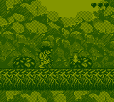

# DocBoy

DocBoy is an open source, accuracy-focused, GameBoy (DMG) emulator, written in C++17.

Can be used either with the standalone SDL frontend or as a libretro core (e.g. with RetroArch).

---

## Features

### GameBoy features
* CPU: M-cycle accurate
* PPU: T-cycle accurate (implements Pixel FIFO)
* APU (audio)
* Colors (CGB)
* Cartridges: NoMBC, MBC1, MBC2, MBC3, MBC5
* Real Time Clock (RTC) emulation
* Memory buses (EXT, CPU, OAM, VRAM) and MMU (for accurately handle read/write conflicts)
* Timers
* Interrupts
* DMA
* JoyPad

### Frontend features
* CLI debugger (in GDB style): supports disassemble, breakpoints, watchpoints, step by step execution, rewind, memory viewer, interrupts viewer, IO viewer
* Serial Link (output to console)
* Save/Load
* Save/Load state
* Fast-forward
* Configurable palette
* Screenshots
* Graphical menu (SDL)

---

## Installation

You can find the latest executables for both Windows and Linux in the [Releases Page](https://github.com/Docheinstein/docboy/releases).

Alternatively, you can build the project by yourself as explained below.

### Clone
Clone the repository and its submodules.

```
git clone https://github.com/Docheinstein/docboy.git --recurse-submodules
```

### Build

DocBoy can be compiled as a static library which can be used by a _frontend_.

These are the CMake options for the available _frontends_.

* `BUILD_SDL_FRONTEND` (default)
* `BUILD_LIBRETRO_CORE`
* `BUILD_LIBRETRO_CORE_ANDROID`
* `BUILD_NOGUI_FRONTEND`

**SDL**

```
mkdir build
cd build
cmake ..
make -j 8
```

Additional dependencies:
* An audio framework: for Linux you can install [alsa-lib](https://github.com/alsa-project/alsa-lib)

**Libretro Core**

```
mkdir build
cd build
cmake .. -DBUILD_LIBRETRO_CORE=ON
make -j 8
```


**Android**

1. Install [NDK](https://developer.android.com/ndk/guides).
2. Enable the CMake option `BUILD_LIBRETRO_CORE_ANDROID`.
3. Set the CMake option `NDK_PATH` to your NDK path (the folder should contain the `ndk-path` executable).

That is:
```
mkdir build
cd build
cmake .. -DBUILD_LIBRETRO_CORE_ANDROID=ON -DNDK_PATH=/opt/AndroidSdk/ndk/25.2.9519653/build
make
```

_Note_: use just `make` instead of `make -j`; the latter does not work with NDK build.

### CMake options

These are all the supported CMake options.

| CMake option                | Description                           | Default Value |
|-----------------------------|---------------------------------------|---------------|
| BUILD_TESTS                 | Build tests                           | OFF           |
| BUILD_DEVTOOLS              | Build devtools                        | OFF           |
| BUILD_NOGUI_FRONTEND        | Build NoGUI frontend                  | OFF           |
| BUILD_SDL_FRONTEND          | Build SDL frontend                    | ON            |
| BUILD_LIBRETRO_CORE         | Build libretro core                   | OFF           |
| BUILD_LIBRETRO_CORE_ANDROID | Build libretro core for Android       | OFF           |
| NDK_PATH                    | NDK path for Android build            |               |
| ENABLE_DEBUGGER             | Enable debugger                       | OFF           |
| ENABLE_BOOTROM              | Enable boot rom                       | OFF           |
| ENABLE_AUDIO                | Enable audio                          | ON            |
| ENABLE_CGB                  | Enable GameBoy Color                  | ON            |
| ENABLE_TWO_PLAYERS_MODE     | Enable two players mode (serial link) | ON            |
| ENABLE_ASSERTS              | Enable asserts                        | OFF           |

---

## Usage

### SDL

```
usage: [rom] [--config CONFIG] [--serial] [--scaling SCALING] [--cartridge-info]
       [--debugger] [--help]

positional arguments:
  rom                    ROM

options:
  -c, --config CONFIG    Read configuration file
  -s, --serial           Display serial console
  -z, --scaling SCALING  Scaling factor
  -i, --cartridge-info   Dump cartridge info and quit
  -d, --debugger         Attach debugger
  -h, --help             Display this help message and quit
```

**Controls**

These are the default controls.

All the joypad keys can be remapped through the _Control Options_ menu.

| Button | Action                   |
|--------|--------------------------|
| F1     | Save State               |
| F2     | Load State               |
| F11    | Dump framebuffer         |
| F12    | Screenshot               |
| F      | Show / Hide FPS          |
| Q      | Decrease speed           |
| W      | Increase speed           |
| D      | Attach / Detach debugger |
| Enter  | START                    |
| Tab    | SELECT                   |
| Z      | A                        |
| X      | B                        |
| Up     | UP                       |
| Right  | RIGHT                    |
| Down   | DOWN                     |
| Left   | LEFT                     |

### Retroarch (libretro)

With [RetroArch](https://www.retroarch.com/) (supported by almost every existing platform, including Android and iOS), you can _Load Core_ the libretro core compiled with the `BUILD_LIBRETRO_CORE` or `BUILD_LIBRETRO_CORE_ANDROID`.

If you're on a desktop environment, you can also load the core from command line:

```retroarch -L build/docboy_libretro.so <rom>```

---

## Debugging

DocBoy offers a CLI debugger (in GDB style) that's really useful to see what's going on under the hood.

To build with the debugger support, enable the CMake `ENABLE_DEBUGGER` option.

```
mkdir build
cd build
cmake .. -DENABLE_DEBUGGER=ON
make -j 8
```

Use the `-d` option to run with the debugger already attached from the beginning, or press the key `D` to attach/detach the debugger at any time.

**Commands**

With `help` you can list the commands:
```
b <addr>                             : Set breakpoint at <addr>
w[/r|a] <start>,<end> [<cond>]       : Set watchpoint from <start> to <end>
w[/r|a] <addr> [<cond>]              : Set watchpoint at <addr>
del <num>                            : Delete breakpoint or watchpoint <num>
ad <past> <next>                     : Automatically disassemble past <past> and next <next> instructions
ad <num>                             : Automatically disassemble next <num> instructions (default = 10)
x[x][/<length><format>] <addr>       : Display memory at <addr> (x: raw) (<format>: x, h[<cols>], b, d, i)
/b <bytes>                           : Search for <bytes>
/i <bytes>                           : Search for instructions matching <bytes>
display[x][/<length><format>] <addr> : Automatically display memory at <addr> (x: raw) (<format>: x, h[<cols>], b, d, i)
undisplay                            : Undisplay expressions set with display
key <press|release> <key>            : Send 'press' or 'release' event for <key> (<key>: a, b, start, select, up, down, left, right)
t [<count>]                          : Continue running for <count> clock ticks (default = 1)
. [<count>]                          : Continue running for <count> PPU dots (default = 1)
s [<count>]                          : Continue running for <count> instructions (default = 1)
si [<count>]                         : Continue running for <count> micro-operations (default = 1)
n [<count>]                          : Continue running for <count> instructions at the same stack level (default = 1)
ni [<count>]                         : Continue running for <count> micro-operations at the same stack level (default = 1)
f [<count>]                          : Continue running for <count> frames (default = 1)
fb [<count>]                         : Step back by <count> frames (default = 1, max = 600)
l [<count>]                          : Continue running for <count> lines (default = 1)
c [<address>]                        : Continue (optionally stop at <address>)
trace [<level>]                      : Set the trace level or toggle it (output on stderr)
d                                    : Dump the disassemble (output on stderr)
r                                    : Reset the emulator to its initial state
h                                    : Display help
q                                    : Quit
```

Here's the debugger!


---

## Screenshots

### CGB


### DMG





